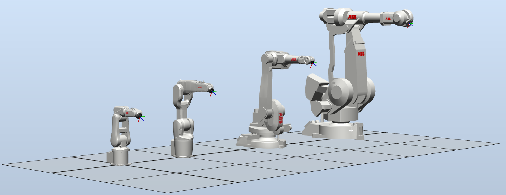

# abb_libegm_samples

## Overview

Samples for the C++ communication library [abb_libegm](https://github.com/ros-industrial/abb_libegm). The library facilitate interaction with ABB robot controllers supporting *Externally Guided Motion* (EGM).

See the abb_libegm library for requirements, dependencies, limitations and recommendations.

### Samples

This package contain the following samples:

**Basic samples (using the EGMTrajectoryInterface class):**
 * a1_joint_trajectory_node
Exemplifies how to create a joint trajectory and how to execute it via EGM.
 * a2_pose_trajectory_node
Exemplifies how to create a pose trajectory and how to execute it via EGM.

**Intermediate samples (using the EGMTrajectoryInterface class):**
 * b1_joint_static_goal_node
Exemplifies how to create a joint static goal and how to execute it via EGM.
 * b2_pose_static_goal_node
Exemplifies how to create a pose static goal and how to execute it via EGM.

**Advanced samples (using the EGMControllerInterface class):**
 * c1_joint_controller_node
Exemplifies how to set up a joint controller, and how to stream the motion references to the robot controller system via EGM.
 * c2_pose_controller_node
Exemplifies how to set up a pose controller, and how to stream the motion references to the robot controller system via EGM.
 * c3_joint_velocity_controller_node
Exemplifies how to set up a joint velocity controller, and how to stream the motion references to the robot controller system via EGM.
 * c4_pose_velocity_controller_node
Exemplifies how to set up a pose velocity controller, and how to stream the motion references to the robot controller system via EGM.

### RobotStudio

The included RobotStudio Pack&Go file EGMSamplesSolution.rspag can be used to setup a RobotStudio station for simulations. The station is prepared to be used to test all the aforementioned samples.

Open the Pack&Go file and follow the instructions in RobotStudio to setup a virtual controller with four robots (see image below). Each robot's task contain RAPID code that sets up and runs EGM.

