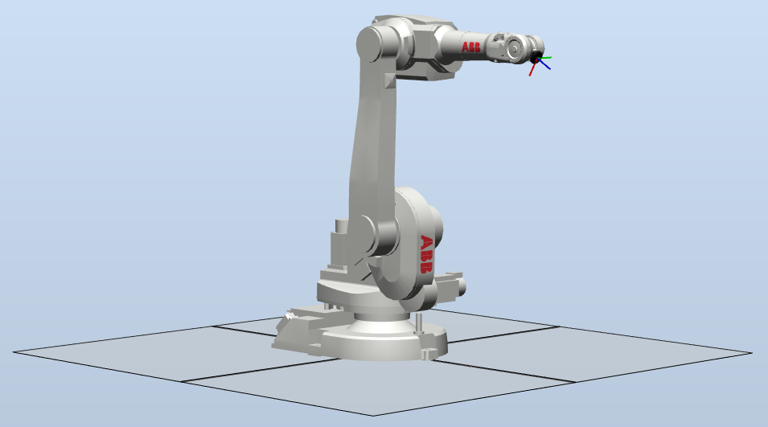

# abb_librws_samples

## Overview

Samples for the C++ communication library [abb_librws](https://github.com/ros-industrial/abb_librws). The library facilitate interaction with ABB robot controllers supporting *Robot Web Services* (RWS).

See the abb_librws library for requirements, dependencies, limitations and recommendations.

### Samples

This package contain the following samples:

**Basic samples (using the RWSInterface class):**
 * a1_collect_info_node
Exemplifies how to collect basic information from a robot controller system (e.g. auto mode, motors on, RAPID running, current jointtarget & robtarget) via RWS.
 * a2_io_signal_node
Exemplifies how to read and write IO-signals defined in the robot controller system via RWS.
 * a3_rapid_execution_node
Exemplifies how to control the RAPUD program's execution flow (i.e. start, stop and reset) via RWS.
 * a4_file_service_node
Exemplifies how to upload, download and remove a file from the robot controller system via RWS.

**Intermediate samples (using the RWSInterface class):**
 * b1_rapid_data_node
Exemplifies how to read and write variables defined in the RAPID program via RWS.
 * b2_subscription_node
Exemplifies how to register subscriptions on resources defined in the robot controller via RWS. A notification will be sent from the robot controller when there is a change in the resources.

**Advanced samples (using the RWSStateMachineInterface class):**
 * c1_state_machine_interface_node
Not implemented yet.

### RobotStudio

The included RobotStudio Pack&Go file RWSSamplesSolution.rspag can be used to setup a RobotStudio station for simulations. The station is prepared to be used to test the aforementioned basic and intermediate samples.

Open the Pack&Go file and follow the instructions in RobotStudio to setup a virtual controller with one robot (see image below). The robot's task contain RAPID code that can be accessed via RWS.

